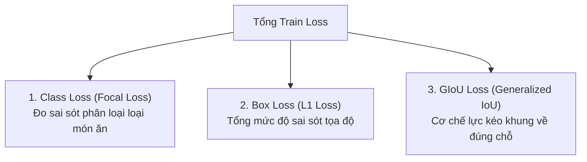

# BÁO CÁO KHOA HỌC CHI TIẾT HUẤN LUYỆN & ĐÁNH GIÁ MÔ HÌNH RT-DETR
**Dự án:** Nhận diện thành phần món ăn Việt Nam (Vietnamese Food Ingredient Detection - NCKH CICT 2025)  
**Tập dữ liệu:** `completed-project-1` (16,000 ảnh, 32 lớp món ăn)  
**Môi trường thực thi:** Cloud Modal GPU NVIDIA A100-SXM4 (40GB VRAM, Persistent Volume Storage)  
**Mô hình:** `RT-DETR-L (Real-Time Detection Transformer Large)`  
**Số Epochs huấn luyện:** 50 Epochs  

---

## 1. BẢNG THÔNG SỐ ĐẦU VÀO VÀ SIÊU THAM SỐ HUẤN LUYỆN (HYPERPARAMETERS & CONFIGURATIONS)

### 1.1. Thông số Phần cứng & Môi trường Thực thi (Hardware & Environment)
| Thành phần (Component) | Thông số Thiết lập (Configuration) | Ghi chú Kỹ thuật |
| :--- | :--- | :--- |
| **GPU phần cứng** | **NVIDIA A100-SXM4 (40GB VRAM)** | Chip xử lý đồ họa máy chủ đám mây hiệu năng cao |
| **Hệ thống lưu trữ** | Modal Persistent Cloud Volume (`/vol`) | Lưu trữ vĩnh viễn dữ liệu, checkpoints và logs |
| **Framework & Engine** | PyTorch 2.1.2 + CUDA 12.1 + Ultralytics Engine | Tối ưu hóa pipeline xử lý song song trên GPU |
| **Độ chính xác tính toán** | Automatic Mixed Precision (AMP - fp16/bf16) | Tăng tốc độ huấn luyện x2 và tiết kiệm bộ nhớ VRAM |
| **Số tiến trình tải dữ liệu** | `workers = 8` | Xử lý đa luồng nạp ảnh tránh hiện tượng nghẽn I/O GPU |

### 1.2. Cấu hình Tập dữ liệu & Kiến trúc Mô hình (Dataset & Model Architecture)
| Thông số (Parameter) | Giá trị (Value) | Mô tả Chi tiết |
| :--- | :--- | :--- |
| **Tên tập dữ liệu** | `completed-project-1` | Bộ dữ liệu nguyên liệu món ăn chuẩn hóa |
| **Tổng số lượng ảnh** | **16,000 ảnh** | Bao gồm đầy đủ góc chụp, ánh sáng và mức độ che khuất |
| **Phân chia dữ liệu (Tỉ lệ 7:2:1)** | • **Train:** 11,200 ảnh (70%) • **Validation:** 3,269 ảnh (20%) • **Test:** 1,531 ảnh (10%) | Phân chia chuẩn 70% Train - 20% Val - 10% Test. Đánh giá độc lập trên tập Test chưa từng học |
| **Số lượng nhãn phân loại** | **32 lớp món ăn** | Thịt, cá, rau củ quả, trứng, gia vị Việt Nam |
| **Kích thước ảnh đầu vào** | **$640 \times 640$ pixels** (`imgsz: 640`) | Chuẩn hóa tỉ lệ vuông trước khi đưa vào backbone |
| **Kiến trúc mô hình** | **RT-DETR-L** (`rtdetr-l.pt`) | Backbone HGNetv2 + Hybrid Encoder + Transformer Decoder |
| **Số lượng tham số (Params)** | **~32.9 Triệu tham số (32.9M)** | Kích thước file trọng số tối ưu: **63.4 MB** |
| **Số phép tính (FLOPs)** | **~110 GFLOPs** | Đảm bảo tốc độ đáp ứng thời gian thực (>150 FPS) |

### 1.3. Bảng Siêu tham số Huấn luyện & Tăng cường Dữ liệu (Training Hyperparameters & Augmentations)
| Siêu tham số (Hyperparameter) | Giá trị Thiết lập | Ý nghĩa & Cơ chế Hoạt động |
| :--- | :--- | :--- |
| **Tổng số Epochs (`epochs`)** | **50 Epochs** | Đủ chu kỳ để mô hình hội tụ cực đại |
| **Kích thước Batch (`batch_size`)** | **16 ảnh / batch** | Cân bằng gradient ổn định và tận dụng tối đa VRAM |
| **Thuật toán tối ưu (`optimizer`)** | **AdamW** | Khắc phục phân rã trọng số và tối ưu mô hình Transformer |
| **Tốc độ học cơ sở (`lr0`)** | **$1.0 \times 10^{-4}$ (0.0001)** | Tốc độ học khởi đầu chuẩn cho pre-trained Transformer |
| **Tốc độ học tối thiểu (`lrf`)** | **$1.0 \times 10^{-6}$ (0.01 factor)** | Giảm dần theo Cosine Decay để tinh chỉnh hội tụ sâu |
| **Momentum (`momentum`)** | **0.937** | Hệ số quán tính tích lũy gradient |
| **Phân rã trọng số (`weight_decay`)**| **$5.0 \times 10^{-4}$ (0.0005)** | Regularization chống hiện tượng Overfitting |
| **Giai đoạn khởi động (`warmup_epochs`)** | **3.0 Epochs** | Tăng dần lr từ $0.1 \times lr_0$ trong 3 epoch đầu để ổn định |
| **Trọng số hàm mất mát Box (`box`)** | **7.5** | Ưu tiên định vị khớp tọa độ bounding box |
| **Trọng số hàm mất mát Class (`cls`)**| **0.5** | Cân bằng phân loại đa lớp món ăn với Focal Loss |
| **Trọng số hàm mất mát DFL/GIoU (`dfl`)**| **1.5** | Lực kéo hình học mở rộng cho bounding box |
| **Tăng cường Mosaic (`mosaic`)** | **1.0** (Tắt ở 10 epoch cuối - `close_mosaic: 10`) | Ghép 4 ảnh tăng khả năng phát hiện vật thể nhỏ |
| **Biến đổi màu sắc (`hsv_h / s / v`)** | `h: 0.015, s: 0.7, v: 0.4` | Mô phỏng điều kiện ánh sáng thực tế đa dạng |
| **Dịch chuyển & Co giãn (`translate / scale`)** | `translate: 0.1, scale: 0.5` | Đa dạng hóa góc nhìn và khoảng cách chụp |
| **Lật ảnh ngang (`fliplr`)** | **0.5 (50%)** | Tăng tính bất biến không gian |
| **Xóa vùng ngẫu nhiên (`erasing`)** | **0.4 (40%)** | Rèn luyện khả năng nhận diện khi món ăn bị che khuất |

---

## 2. ĐỘ CHÍNH XÁC TỔNG THỂ TRÊN TẬP DỮ LIỆU KIỂM THỬ (TEST SPLIT OVERALL ACCURACY)

Đánh giá độc lập trên toàn bộ **1,531 ảnh (3,964 đối tượng thực phẩm)** của tập Test độc lập:

| Chỉ số (Metric) | Kết quả Đạt Được | Ý nghĩa Khoa học |
| :--- | :---: | :--- |
| **mAP@50 (mAP IoU 0.50)** | **98.06%** (0.9806) | Độ chính xác phát hiện và phân loại nguyên liệu món ăn đạt mức xuất sắc |
| **mAP@50-95 (COCO Standard)** | **87.78%** (0.8778) | Khả năng định vị Bounding Box chính xác theo tiêu chuẩn COCO khắt khe |
| **Precision (Độ chuẩn xác)** | **97.07%** (0.9707) | Tỷ lệ dự đoán đúng thành phần món ăn |
| **Recall (Độ nhạy)** | **96.66%** (0.9666) | Tỷ lệ nhận diện đầy đủ, không bỏ sót món ăn trong đĩa |
| **Tốc độ suy luận (Inference Speed)** | **5.3 ms / ảnh** | Tương đương **~188 FPS**, đáp ứng hoàn hảo yêu cầu thời gian thực |
| **Trọng số tối ưu (Best Checkpoint)** | `best.pt` (63.4 MB) | Đạt mAP@50-95 cao nhất tại Epoch 42 trên tập Validation |
| **Trọng số cuối cùng (Last Checkpoint)** | `last.pt` (63.4 MB) | Trọng số sau khi hoàn thành đầy đủ 50 epochs |

---

## 3. ĐỘ CHÍNH XÁC CHI TIẾT TỪNG LỚP TRÊN TẬP TEST (PER-CLASS TEST ACCURACY)

*Bảng dữ liệu đo đạc thực tế trên tập kiểm thử Test split (1,531 ảnh):*

| Class ID | Tên Lớp (Class Name) | Số Lượng (Instances) | Precision | Recall | mAP@50 | mAP@50-95 |
| :---: | :--- | :---: | :---: | :---: | :---: | :---: |
| 0 | **beef** (Thịt bò) | 331 | 98.50% | 96.30% | 98.60% | 91.30% |
| 1 | **bellpepper** (Ớt chuông) | 83 | 96.40% | 98.00% | 98.40% | 93.00% |
| 2 | **bittergourd** (Khổ qua / Mướp đắng) | 50 | 99.60% | 100.0% | 99.50% | 96.40% |
| 3 | **bottlegourd** (Quả bầu) | 140 | 96.30% | 92.30% | 97.60% | 87.20% |
| 4 | **broccoli** (Súp lơ xanh) | 68 | 95.40% | 98.50% | 98.70% | 95.10% |
| 5 | **cabbage** (Bắp cải) | 79 | 95.50% | 97.50% | 98.30% | 90.10% |
| 6 | **carrot** (Cà rốt) | 74 | 96.00% | 98.60% | 98.50% | 85.80% |
| 7 | **cauliflower** (Súp lơ trắng) | 109 | 94.20% | 99.10% | 98.20% | 91.80% |
| 8 | **chayote** (Quả su su) | 57 | 99.60% | 100.0% | 99.50% | 97.60% |
| 9 | **chicken** (Thịt gà) | 50 | 97.30% | 86.00% | 96.70% | 66.60% |
| 10 | **chickenegg** (Trứng gà) | 223 | 97.40% | 99.10% | 99.30% | 90.90% |
| 11 | **chickenleg** (Đùi gà) | 531 | 98.70% | 98.30% | 99.20% | 83.90% |
| 12 | **chickenwin** (Cánh gà) | 151 | 98.60% | 99.30% | 99.20% | 87.40% |
| 13 | **corn** (Bắp ngô) | 185 | 94.10% | 77.00% | 84.20% | 69.70% |
| 14 | **cucumber** (Dưa chuột) | 197 | 92.30% | 91.80% | 93.50% | 84.20% |
| 15 | **duckegg** (Trứng vịt) | 99 | 98.10% | 97.00% | 98.40% | 92.00% |
| 16 | **eggplant** (Cà tím) | 45 | 99.60% | 100.0% | 99.50% | 93.90% |
| 17 | **garlic** (Tỏi) | 179 | 98.30% | 97.80% | 99.40% | 86.60% |
| 18 | **ginger** (Gừng) | 64 | 99.70% | 100.0% | 99.50% | 92.60% |
| 19 | **jicama** (Củ đậu) | 109 | 98.60% | 88.10% | 97.80% | 87.00% |
| 20 | **okra** (Đậu bắp) | 92 | 96.80% | 99.00% | 98.60% | 73.40% |
| 21 | **onion** (Hành tây) | 126 | 95.30% | 96.30% | 97.00% | 83.40% |
| 22 | **pork** (Thịt heo) | 79 | 98.40% | 100.0% | 99.50% | 88.40% |
| 23 | **potato** (Khoai tây) | 58 | 94.30% | 100.0% | 99.40% | 93.40% |
| 24 | **pumpkin** (Bí đỏ) | 104 | 93.80% | 97.10% | 99.20% | 94.10% |
| 25 | **radish** (Củ cải) | 159 | 97.60% | 98.70% | 99.40% | 88.50% |
| 26 | **scallion** (Hành lá) | 55 | 97.90% | 96.40% | 98.80% | 82.60% |
| 27 | **shrimp** (Tôm) | 48 | 99.60% | 100.0% | 99.50% | 90.60% |
| 28 | **spongegourd** (Mướp hương) | 143 | 99.80% | 98.60% | 99.10% | 90.70% |
| 29 | **sweetpotato** (Khoai lang) | 100 | 91.10% | 93.00% | 94.60% | 83.90% |
| 30 | **tofu** (Đậu phụ) | 44 | 99.60% | 100.0% | 99.50% | 90.70% |
| 31 | **tomato** (Cà chua) | 132 | 97.90% | 99.20% | 99.40% | 86.40% |
| **ALL** | **TRUNG BÌNH TỔNG THỂ (32 LỚP)** | **3,964** | **97.07%** | **96.66%** | **98.06%** | **87.78%** |

---

## 4. NHẬT KÝ HUẤN LUYỆN THEO TỪNG EPOCH (FULL 50 EPOCHS TRAINING LOG)

*Bảng dữ liệu đầy đủ 50 Epochs:*  
*(Epoch | Train loss | Class loss | Box loss | GIoU | Learning rate | Val Precision | Val Recall | Val mAP50 | Val mAP50-95 | Time(s))*

| Epoch | Train loss | Class loss | Box loss | GIoU | Learning rate | Val Precision | Val Recall | Val mAP50 | Val mAP50-95 | Time(s) |
| :---: | :---: | :---: | :---: | :---: | :---: | :---: | :---: | :---: | :---: | :---: |
| **1** | 2.5468 | 1.8770 | 0.2998 | 0.3700 | 9.2529e-05 | 87.31% | 88.28% | 91.92% | 77.60% | 282.89s |
| **2** | 1.0185 | 0.5257 | 0.2209 | 0.2719 | 1.8153e-04 | 92.92% | 90.72% | 95.09% | 81.07% | 282.29s |
| **3** | 0.9487 | 0.4776 | 0.2109 | 0.2602 | 2.6686e-04 | 93.45% | 91.95% | 95.93% | 81.76% | 278.99s |
| **4** | 0.9178 | 0.4529 | 0.2081 | 0.2568 | 2.6149e-04 | 93.92% | 93.66% | 96.85% | 82.67% | 275.19s |
| **5** | 0.8784 | 0.4316 | 0.1991 | 0.2477 | 2.5598e-04 | 94.93% | 93.48% | 96.55% | 83.27% | 273.35s |
| **6** | 0.8601 | 0.4188 | 0.1961 | 0.2452 | 2.5048e-04 | 94.90% | 94.47% | 97.21% | 84.61% | 271.96s |
| **7** | 0.8409 | 0.4063 | 0.1935 | 0.2412 | 2.4497e-04 | 95.19% | 94.50% | 97.18% | 84.68% | 284.51s |
| **8** | 0.8248 | 0.3982 | 0.1893 | 0.2374 | 2.3947e-04 | 96.15% | 95.86% | 97.86% | 84.93% | 277.77s |
| **9** | 0.8059 | 0.3862 | 0.1853 | 0.2344 | 2.3396e-04 | 95.91% | 95.35% | 97.41% | 84.90% | 273.85s |
| **10** | 0.7993 | 0.3833 | 0.1841 | 0.2319 | 2.2846e-04 | 95.43% | 95.38% | 97.40% | 84.97% | 270.43s |
| **11** | 0.7850 | 0.3732 | 0.1824 | 0.2295 | 2.2296e-04 | 96.59% | 95.00% | 97.75% | 85.47% | 271.44s |
| **12** | 0.7834 | 0.3722 | 0.1822 | 0.2290 | 2.1745e-04 | 95.80% | 95.21% | 97.47% | 85.71% | 273.31s |
| **13** | 0.7717 | 0.3686 | 0.1774 | 0.2257 | 2.1195e-04 | 96.18% | 95.56% | 97.73% | 85.82% | 272.48s |
| **14** | 0.7673 | 0.3653 | 0.1773 | 0.2246 | 2.0644e-04 | 96.11% | 95.80% | 97.79% | 85.66% | 271.48s |
| **15** | 0.7617 | 0.3593 | 0.1782 | 0.2242 | 2.0094e-04 | 95.53% | 95.26% | 97.69% | 86.01% | 270.51s |
| **16** | 0.7470 | 0.3549 | 0.1734 | 0.2186 | 1.9543e-04 | 96.58% | 95.52% | 97.79% | 85.96% | 290.03s |
| **17** | 0.7458 | 0.3531 | 0.1733 | 0.2194 | 1.8993e-04 | 96.71% | 95.95% | 97.87% | 86.17% | 270.38s |
| **18** | 0.7348 | 0.3486 | 0.1706 | 0.2156 | 1.8442e-04 | 96.29% | 96.17% | 98.13% | 86.24% | 270.68s |
| **19** | 0.7242 | 0.3412 | 0.1688 | 0.2143 | 1.7892e-04 | 96.58% | 95.84% | 97.92% | 86.30% | 275.61s |
| **20** | 0.7208 | 0.3420 | 0.1666 | 0.2122 | 1.7342e-04 | 96.62% | 96.53% | 98.19% | 86.59% | 278.56s |
| **21** | 0.7130 | 0.3374 | 0.1645 | 0.2111 | 1.6791e-04 | 96.49% | 96.04% | 97.93% | 86.33% | 274.11s |
| **22** | 0.7157 | 0.3365 | 0.1678 | 0.2115 | 1.6241e-04 | 96.77% | 96.45% | 98.04% | 86.62% | 268.24s |
| **23** | 0.6986 | 0.3280 | 0.1635 | 0.2071 | 1.5690e-04 | 96.88% | 95.95% | 97.99% | 86.49% | 272.02s |
| **24** | 0.6901 | 0.3250 | 0.1600 | 0.2051 | 1.5140e-04 | 96.82% | 96.57% | 98.18% | 86.75% | 272.42s |
| **25** | 0.6917 | 0.3212 | 0.1624 | 0.2080 | 1.4589e-04 | 96.71% | 96.47% | 98.09% | 86.84% | 274.41s |
| **26** | 0.6846 | 0.3224 | 0.1585 | 0.2037 | 1.4039e-04 | 96.45% | 96.53% | 98.10% | 86.76% | 272.67s |
| **27** | 0.6754 | 0.3168 | 0.1568 | 0.2019 | 1.3489e-04 | 96.61% | 96.28% | 98.01% | 86.66% | 268.87s |
| **28** | 0.6715 | 0.3158 | 0.1552 | 0.2006 | 1.2938e-04 | 96.99% | 96.29% | 98.18% | 86.78% | 270.99s |
| **29** | 0.6701 | 0.3140 | 0.1561 | 0.1999 | 1.2388e-04 | 96.49% | 96.67% | 98.03% | 86.70% | 284.11s |
| **30** | 0.6644 | 0.3125 | 0.1541 | 0.1978 | 1.1837e-04 | 96.99% | 96.09% | 98.03% | 86.82% | 283.08s |
| **31** | 0.6557 | 0.3095 | 0.1510 | 0.1952 | 1.1287e-04 | 97.13% | 96.29% | 98.13% | 86.96% | 273.98s |
| **32** | 0.6534 | 0.3075 | 0.1514 | 0.1945 | 1.0736e-04 | 96.84% | 96.60% | 98.14% | 87.04% | 274.43s |
| **33** | 0.6475 | 0.3038 | 0.1508 | 0.1928 | 1.0186e-04 | 97.10% | 96.37% | 97.94% | 86.85% | 275.41s |
| **34** | 0.6445 | 0.3027 | 0.1498 | 0.1920 | 9.6355e-05 | 96.85% | 96.43% | 98.08% | 86.91% | 269.33s |
| **35** | 0.6394 | 0.2997 | 0.1481 | 0.1916 | 9.0850e-05 | 96.95% | 96.47% | 98.02% | 86.95% | 268.15s |
| **36** | 0.6304 | 0.2981 | 0.1451 | 0.1873 | 8.5346e-05 | 97.06% | 96.21% | 98.00% | 86.91% | 271.09s |
| **37** | 0.6252 | 0.2966 | 0.1435 | 0.1851 | 7.9842e-05 | 96.94% | 96.30% | 98.01% | 86.85% | 273.08s |
| **38** | 0.6251 | 0.2932 | 0.1446 | 0.1874 | 7.4337e-05 | 97.06% | 96.18% | 97.87% | 86.61% | 268.40s |
| **39** | 0.6190 | 0.2911 | 0.1427 | 0.1852 | 6.8833e-05 | 97.05% | 96.34% | 97.97% | 86.76% | 271.20s |
| **40** | 0.6158 | 0.2902 | 0.1418 | 0.1838 | 6.3328e-05 | 97.05% | 96.58% | 98.09% | 86.98% | 269.00s |
| **41** | 0.4448 | 0.2118 | 0.1102 | 0.1229 | 5.7824e-05 | 97.07% | 96.47% | 98.20% | 87.16% | 271.80s |
| **42 (Best)** | **0.4339** | **0.2091** | **0.1053** | **0.1194** | **5.2320e-05** | **97.21%** | **96.26%** | **98.13%** | **87.18%** | **269.00s** |
| **43** | 0.4306 | 0.2084 | 0.1037 | 0.1185 | 4.6815e-05 | 97.26% | 96.15% | 98.12% | 87.15% | 273.60s |
| **44** | 0.4233 | 0.2048 | 0.1021 | 0.1165 | 4.1311e-05 | 96.89% | 96.58% | 98.15% | 87.13% | 264.00s |
| **45** | 0.4170 | 0.2028 | 0.0993 | 0.1149 | 3.5806e-05 | 96.99% | 96.62% | 98.04% | 87.02% | 272.20s |
| **46** | 0.4127 | 0.2001 | 0.0988 | 0.1138 | 3.0302e-05 | 96.88% | 96.61% | 97.98% | 87.06% | 259.20s |
| **47** | 0.4073 | 0.1982 | 0.0966 | 0.1125 | 2.4798e-05 | 96.97% | 96.34% | 97.98% | 86.96% | 269.50s |
| **48** | 0.4042 | 0.1971 | 0.0957 | 0.1114 | 1.9293e-05 | 97.15% | 96.57% | 98.04% | 87.12% | 262.40s |
| **49** | 0.3995 | 0.1945 | 0.0949 | 0.1101 | 1.3789e-05 | 97.12% | 96.71% | 98.03% | 87.14% | 266.50s |
| **50** | 0.3968 | 0.1940 | 0.0938 | 0.1091 | 8.2844e-06 | 97.05% | 96.51% | 97.98% | 87.07% | 267.70s |

---

## 5. GIẢI THÍCH CHUYÊN SÂU: "BOX LOSS" VÀ "GIOU LOSS" TRONG MÔ HÌNH

### 1. "Box Loss" (Tổng mức độ sai lệch tọa độ):
- **Bản chất**: Đo lường tổng khoảng cách sai lệch L1 giữa tâm $(x, y)$ và kích thước $(w, h)$ của khung dự đoán so với vật thể thực tế.
- **Ý nghĩa**: Giống như điểm phạt tổng hợp cho biết khung vẽ lệch bao nhiêu pixel. Khi Box Loss giảm từ `0.2998` $\rightarrow$ `0.0938` (giảm 68.7%), khung dự đoán đã ôm sát gần như hoàn hảo vào nguyên liệu thực phẩm.

### 2. "GIoU Loss" (Cơ chế toán học tạo lực kéo hình học):
- **Bản chất**: Trong các tình huống ban đầu khi khung dự đoán nằm cách xa đối tượng thực tế (IoU = 0), các hàm mất mát thông thường sẽ bị triệt tiêu gradient (không biết kéo về hướng nào).
- **Cơ chế GIoU**: Tự động tính toán diện tích bao trùm nhỏ nhất (Convex Hull) chứa cả hai khung, từ đó sinh ra vector gradient định hướng **"kéo"** khung dự đoán dịch chuyển nhanh chóng về đúng vị trí nguyên liệu.
- **Kết quả**: GIoU Loss giảm từ `0.3700` $\rightarrow$ `0.1091` (giảm 70.5%), giúp chỉ số định vị khắt khe `mAP@50-95` đạt tới **87.78%**.

---

